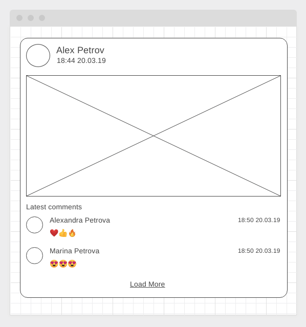

# Домашнее задание к занятию "11. RxJS"

[](https://ci.appveyor.com/project/darknessdizi/javascript-24-rxjs-fronted2)

## Backend

Ссылка на git-hub репозиторий (backend): https://github.com/darknessdizi/JavaScript_24_RxJS_backend2.git

Ссылка сервера на render: https://dashboard.render.com/web/srv-cov16pg21fec73c0fi10/deploys/dep-cov16q021fec73c0fic0

---

## Fronted

Ссылка на git-hub репозиторий (fronted): https://github.com/darknessdizi/JavaScript_24_RxJS_fronted2.git

Ссылка на страницу: https://darknessdizi.github.io/JavaScript_24_RxJS_fronted2/

---

Правила сдачи задания:

1. **Важно**: в рамках этого ДЗ можно использовать любой менеджер пакетов
2. Всё должно собираться через Webpack (включая картинки и стили) и выкладываться на Github Pages через Appveyor
3. В README.md должен быть размещён бейджик сборки и ссылка на Github Pages
4. В качестве результата присылайте проверяющему ссылки на ваши GitHub-проекты
5. Авто-тесты писать не требуется
---
**6. (со звездочкой, пункт не обязателен для выполнения)** Серверная часть должна быть выложена на сервере. Вы можете использовать сервер [Vercel](https://vercel.com/docs/concepts/git) (для 1 и 2 задачи, для 3 задачи серверная часть не требуется)

## Posts with comments* (задача со звёздочкой)

Важно: эта задача не является обязательной. Её (не)выполнение не влияет на получение зачёта по ДЗ.

### Легенда

Вы работаете в компании, занимающейся созданием социальной платформы. А конкретно ваша команда - занимается блоком, связанным с лентой последних постов. Соответственно, вам нужно грузить список последних постов, а поскольку платформа всё-таки социальная, к каждому посту список последних комментариев.

Понятное дело, что по-хорошему, нужно чтобы с сервера приходили посты сразу со списком последних комментариев, но пока разработчики сервеной части упёрлись и сказали, что всё будет отдельно, а именно:
* получение списка последних постов
* получение последних комментариев к конкретному посту по id

### Описание

#### Серверная часть

Как всегда, у разработчиков серверной части ещё ничего не готово, и чтобы не ждать их, вам нужно разработать демо REST-сервер со следующими endpoint'ами:
* GET /posts/latest - список последних постов (не более 10) в формате:
```json
{
  "status": "ok",
  "data": [
    {
      "id": "<id>",
      "author_id": "<author_id>",
      "title": "<title>",
      "author": "<author>",
      "avatar": "<avatar>",
      "image": "<url>",
      "created": "<timestamp>"
    },
    ...
  ]
}
```
* GET /posts/\<post_id\>/comments/latest - список последних комментариев к посту (не более 3) в формате:
```json
{
  "status": "ok",
  "data": [
    {
      "id": "<id>",
      "post_id": "<post_id>",
      "author_id": "<author_id>",
      "author": "<author>",
      "avatar": "<avatar>",
      "content": "<content>",
      "created": "<timestamp>"
    },
    ...
  ]
}
```

Для генерации данных можете использовать данные с [jsonplaceholder](https://jsonplaceholder.typicode.com) или библиотеку [faker](https://www.npmjs.com/package/@faker-js/faker)

#### Клиентская часть

С использованием библиотеки rxjs организуйте получение данных о постах и загрузки для каждого поста комментариев так, чтобы в `subscribe` получать уже посты с комментариями (используйте для этого соответствующие операторы).

Общий вид одного поста:



Функциональность кнопки "Load More" реализовывать не нужно.
